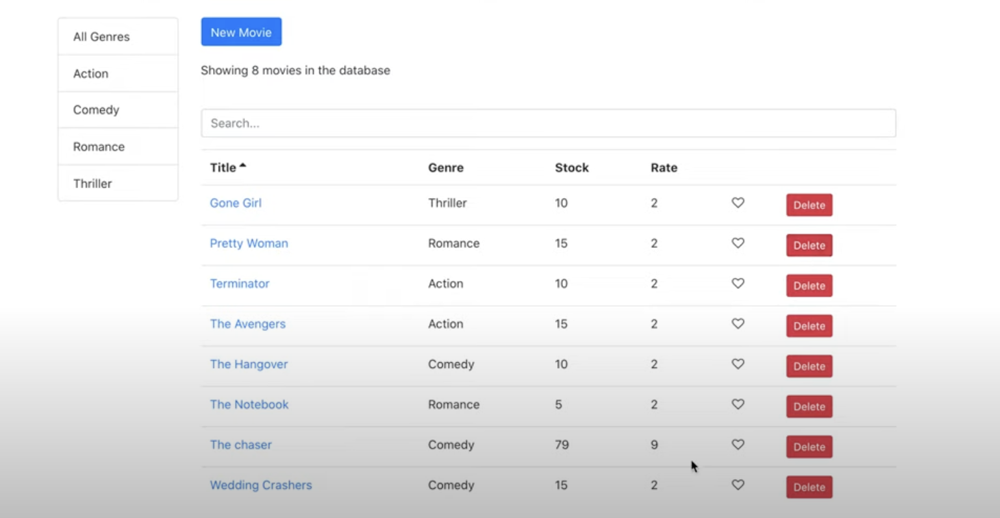

## App Name
Vidly: Your Ultimate Movie Management App

##

## App Description
Vidly is a modern, user-friendly full-stack web application designed to help you effortlessly manage your movie collection. Built using cutting-edge technologies such as React, JavaScript, and Node.js, Vidly offers a seamless experience for organizing, discovering, and personalizing your favorite films.

##  Key Features:
Add Movies : Easily add new movies to your collection with just a few clicks. Provide details like title, genre, release year, and more.
Filter by Genre : Quickly sort through your movies by selecting specific genres, making it simple to find exactly what you're in the mood for.
Search Functionality : Use the intuitive search bar to locate any movie in your collection by name or keyword.
Delete Movies : Keep your collection tidy by removing movies you no longer need.
Favorite List : Mark your favorite films and access them instantly from a dedicated favorites section.
With its responsive design and robust backend powered by Node.js, Vidly ensures smooth performance and scalability. Whether you're a movie enthusiast or simply looking to organize your personal film library, Vidly is the perfect tool to enhance your movie-watching experience.

This project was bootstrapped with [Create React App](https://github.com/facebookincubator/create-react-app).

Below you will find some information on how to perform common tasks. 
You can find the most recent version of this guide [here](https://github.com/facebookincubator/create-react-app/blob/master/packages/react-scripts/template/README.md).

## Table of Contents

- [Updating to New Releases](#updating-to-new-releases)
- [Sending Feedback](#sending-feedback)
- [Folder Structure](#folder-structure)
- [Available Scripts](#available-scripts)
  - [npm install](#npm-install)
  - [npm start](#npm-start)
  - [npm test](#npm-test)
  - [npm run build](#npm-run-build)
  - [npm run eject](#npm-run-eject)
